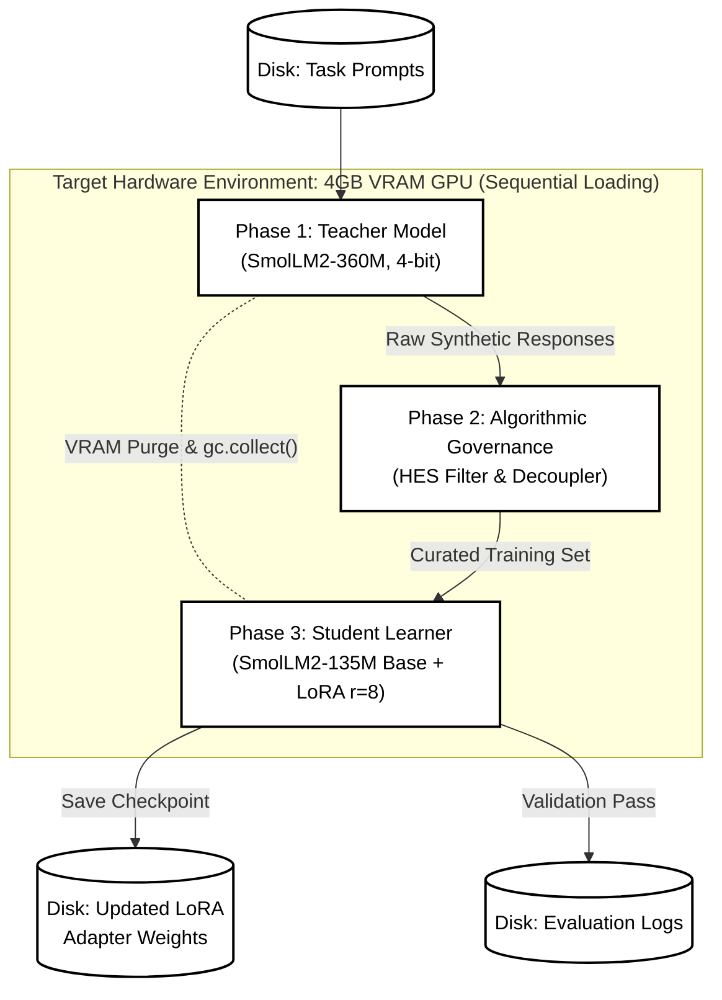

# Dual-SLM Self-Adapting AI Implementation

This project implements an applied "Self-Adapting Learning-Based AI" using an asymmetric Teacher-Student dual-SLM architecture, exactly as detailed in the system prompt.

## Project Structure
- `main.py`: The core pipeline executing the 4 constraints sequentially.
- `requirements.txt`: Required dependencies.

## Architecture Diagram



## Key Features & Constraints Honored
1. **Hardware Constraints:** Designed specifically to fit within a 4GB VRAM environment (RTX 3050). The pipeline aggressively unloads models, performs garbage collection, and clears CUDA cache between phases so that Teacher and Student never coexist in VRAM.
2. **Phase 1 (Generation):** Loads the Teacher model in 4-bit, captures step-by-step reasoning texts along with raw token logits.
3. **Phase 2 (Governance Plane):** An algorithmic gatekeeper that evaluates token-level softmax probabilities to calculate High-Entropy Sum (HES) to identify quality representations and filter out low-entropy (potentially degenerate) responses.
4. **Phase 3 (Update):** Instantiates the raw Student model, configures it with LoRA adapters (targeting `q_proj` and `v_proj`, rank=8, alpha=16) and performs Supervised Fine-Tuning (SFT) over the curated generated dataset. Batch size is 1 with `gradient_accumulation_steps=4` to optimize memory.

*Note on Models*: The system prompt requested `SmolLM3-360M-Instruct` and `SmolLM3-135M-Base`. Given `SmolLM3` is not publicly available on Hugging Face yet, the highly similar `HuggingFaceTB/SmolLM2-360M-Instruct` and `HuggingFaceTB/SmolLM2-135M` variants have been used.

## Usage
Install dependencies:
```bash
pip install -r requirements.txt
```

Run the pipeline:
```bash
python main.py
```
